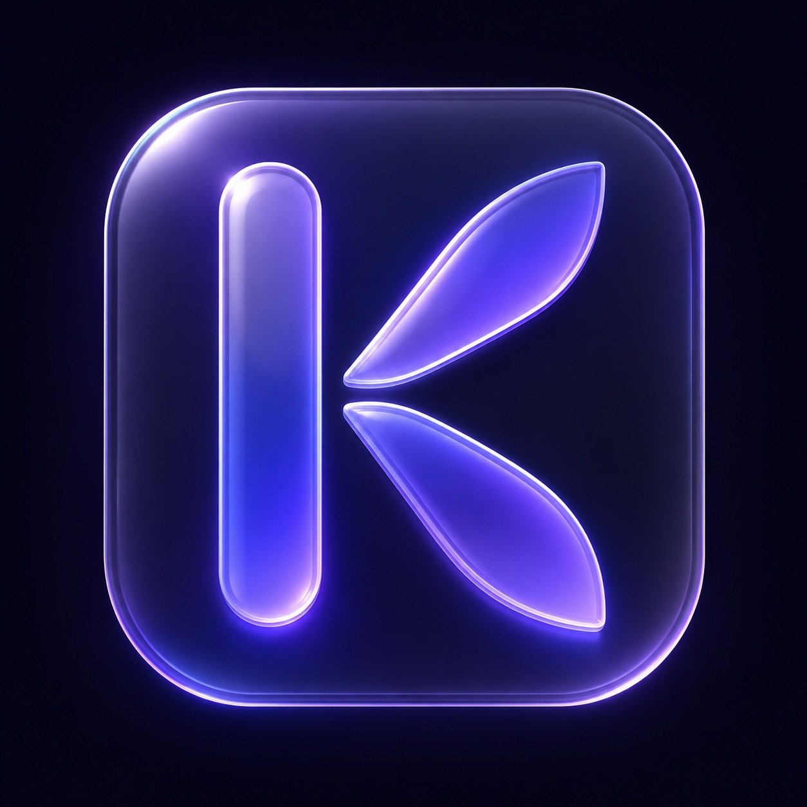

<div align="center">

<!-- Replace this with your logo once you upload it to the repo -->


# KAIROS

### The perfect moment when everything flows.

**Not an operating system. A new way of working.**

Kairos takes the best of macOS, Linux, and Windows — and makes it native, intelligent, and free.

<br />

[](LICENSE)
[](#-roadmap)
[](#-community)
[](#-contributing)

<br />

[**Vision**](#-the-vision) · [**Features**](#-what-kairos-does) · [**AI Agent**](#-the-kairos-ai-agent) · [**KaiRemote**](#-kairemote--your-pc-from-anywhere) · [**Roadmap**](#-roadmap) · [**Contribute**](#-contributing)

</div>

<br />

---

## ⚡ Why Kairos exists

Current operating systems are not broken because they fail — they're broken because they were built for a world that no longer exists.

> **Windows** was built for offices. **macOS** for creatives. **Linux** for engineers.
> None of them were built for the way people actually work today: fast, hybrid, AI-assisted, creative, and demanding.

The best of each system already exists. It has just never been put together in one place. Nobody should have to choose between macOS's beauty, Linux's control, and Windows's compatibility.

**That's a false choice. Kairos refuses to accept it.**

Kairos is built on Windows as a base — keeping its driver and software compatibility — but completely rebuilt from the outside in: interface, services, experience, and intelligence.

<br />

---

## 🌌 The vision

Kairos is the operating system that **anyone who works with a computer will want to use.** Not because it's trendy — but because after using it, going back feels impossible.

Every single decision in Kairos answers one question:

> **Does this make the user faster, smarter, and more focused?**
> If the answer is no, it doesn't exist.

And Kairos is **free, forever.** Access to good tools shouldn't depend on your budget.

<br />

### The six principles

| | Principle | What it means |
|---|---|---|
| **01** | **Flow above all** | Every interaction feels instant. If something takes more than one step, we eliminate the other steps. |
| **02** | **Intelligence is infrastructure** | AI isn't a feature or a button. It's part of the OS — like the file system or memory. Always there. |
| **03** | **Honest beauty** | Beautiful design isn't decoration. It reduces cognitive load and stress. Kairos looks as good as it runs. |
| **04** | **Total control** | The user owns their system. No telemetry without consent. No forced updates. No hidden background services. |
| **05** | **Universal compatibility** | If it runs on Windows, it runs on Kairos. DAWs, Adobe, games, pro software. Zero compromises. |
| **06** | **Free forever** | No paywalls on essential features. Ever. |

<br />

---

## 🎯 The best of every system

Kairos is built on a simple philosophy: **take what works from each system, and make it native.**

<table>
<tr>
<td valign="top" width="33%">

### From macOS 
- Consistent, coherent visual design
- Fluid Dock with magnification
- Spotlight-style instant search
- Universal keyboard shortcuts
- Multi-touch trackpad gestures
- Smooth spring-physics animations
- Superior font rendering
- Non-intrusive notifications

</td>
<td valign="top" width="33%">

### From Linux 
- Total system control
- Zero telemetry without consent
- Fully configurable services
- Powerful modern terminal
- Full transparency
- Privacy by design
- Deep keyboard navigation
- No bloatware

</td>
<td valign="top" width="33%">

### From Windows 
- 100% software compatibility
- Universal driver support
- Windows Update maintained
- Win32, DirectX, WSL2
- Familiar ecosystem
- Gaming-ready

</td>
</tr>
</table>

<br />

---

## ✨ What Kairos does

### 🖥️ Shell & Interface
A custom shell that replaces Windows Explorer completely — built for fluidity and beauty.

- **Custom Dock** with physics animations and magnification
- **KaiSpot** — intelligent global search (`Alt + Space`): files, apps, settings, web, conversions, all AI-powered
- **Glassmorphism + dark theme** as the default visual language
- **Window Manager** with smooth, physical animations
- **Coherent design system** across every native app
- **Virtual desktops** with fluid gestures

### ⚙️ System Optimization
- Unnecessary services **disabled** — clean, user-configurable
- **I/O and RAM scheduler** tuned for creative and professional workloads
- **Windows Update controlled** — you decide when and what
- **Zero bloatware** — nothing preinstalled except Kairos natives
- **Privacy Mode** — telemetry blocked at the system level

### 🚀 Productivity
- **KaiNotes** — floating notes (text, audio, screenshots) saved to organized folders, accessible from anywhere
- **Clipboard Manager** with full searchable history
- **macOS-style shortcuts** remapped universally
- **Focus Mode** — blocks distractions, optimizes resources for the active task

### 🧑‍💻 Developer Tools
- Modern integrated terminal
- Native **WSL2** with improved integration
- **Kairos PKG** — own package manager (+ winget + chocolatey)
- **Dev Mode** — optimized environment for developers

<br />

---

## 🤖 The Kairos AI Agent

> The agent is not a chatbot. It's a layer of intelligence integrated into the OS that **sees, understands, and acts.**

The AI in Kairos is always there — watching what you're doing, ready to help at the exact moment you need it. Never intrusive. Always available.

### Bring your own model

Kairos doesn't lock you into one AI. **You** configure your own API key and choose your provider:

`Claude` · `GPT` · `Gemini` · `Local (Ollama)`

This means **total freedom**, **full privacy** (your data goes to your account, not ours), and **no infrastructure cost** for the project.

### Three levels of capability

```
┌─ Level 1 · PERCEPTION ──────────────────────────────┐
│  Sees your screen, active app, open files, clipboard │
│  (fully user-configurable and deactivatable)         │
└──────────────────────────────────────────────────────┘
                          ↓
┌─ Level 2 · ASSISTANCE ──────────────────────────────┐
│  Contextual suggestions · answers about your task    │
│  proactive error detection · docs surfaced in context│
└──────────────────────────────────────────────────────┘
                          ↓
┌─ Level 3 · ACTION ──────────────────────────────────┐
│  Runs commands · organizes files · controls apps     │
│  writes & runs code · automates repetitive tasks     │
└──────────────────────────────────────────────────────┘
```

### KaiAssist — the global panel

Press `Alt + K` anywhere to open a floating panel:

- 🎙️ **Voice note** → transcribed and saved
- ✍️ **Quick note** → auto-organized by date and category
- 📸 **Screenshot + analysis** → understands what's on screen
- ⚡ **Command** → *"Move all PDFs from Desktop to Documents"* → done

**Privacy first:** everything stays on your device. Nothing is sent to Kairos servers. Full audit log of every action. Pause the agent anytime.

<br />

---

## 📱 KaiRemote — your PC from anywhere

> Turn off your PC, leave home, and from your phone wake it, start a render, and get notified when it's done — without touching the computer.

KaiRemote lets you talk to your PC through **WhatsApp or Telegram**, in natural language, from anywhere on earth. No other OS offers this natively.

```
You (WhatsApp / Telegram)  →  Secure bridge  →  Kairos agent on your PC  →  Action  →  Reply back to you
```

**Examples:**
- *"Send me the file from project X"* → arrives in your chat
- *"Did the track finish rendering?"* → checks and reports back
- *"Start the render and notify me when it's done"* → full autonomy
- *"Send me a screenshot"* → you get the image

### Wake a sleeping PC remotely

Kairos uses **Wake-on-LAN** with an honest, zero-hardware default:

| Mode | What it needs |
|---|---|
| **Intelligent Suspend** *(default)* | Nothing. PC sleeps at ~1–2W and wakes remotely. Covers ~90% of users. |
| **Compatible Router** | Nothing extra. Kairos detects and configures it automatically. |
| **Bridge Device** *(advanced)* | Optional always-on device (e.g. Raspberry Pi) for true full-shutdown wake. |

### Zero-config setup with AI

On first boot, the **Kai post-install assistant** sets everything up conversationally — hardware, network, wake config, messaging link, and service optimization. **You touch nothing technical. The AI does the heavy lifting.**

> 🔒 **Security is critical here.** KaiRemote uses strong authentication (verified account only), end-to-end encryption, a command whitelist, confirmation for destructive actions, a full audit log, and an instant "Pause Remote" kill switch.

<br />

---

## 🗺️ Roadmap

Kairos is built **in public**, in phases. Each phase produces something real and usable.

| Phase | Focus | Key deliverables | Status |
|:---:|---|---|:---:|
| **0** | **Identity & Community** | Name, logo, this repo, Discord, landing page | 🟢 In progress |
| **1** | **Optimized Base** | Win11 LTSC + debloat + custom installer + first ISO | ⚪ Planned |
| **2** | **Shell MVP** | Dock, KaiSpot, theme, macOS shortcuts | ⚪ Planned |
| **3** | **AI Agent v1** | KaiAssist, notes, screen reading, commands | ⚪ Planned |
| **4** | **KaiRemote** | Telegram control, Wake-on-LAN, zero-config install | ⚪ Planned |
| **5** | **Ecosystem** | Package manager, app store, docs, v1.0 | ⚪ Planned |

### Milestones

- **M0** — Public repo + identity that makes people want to join
- **M1** — First downloadable ISO (real, installable)
- **M2** — First public demo of the shell on real hardware
- **M3** — KaiAssist running with basic AI commands
- **M4** — KaiRemote: Telegram control + remote wake working
- **M5** — Public beta
- **M6** — **v1.0 — ready for daily use**

<br />

---

## 🏗️ Architecture at a glance

```
┌─────────────────────────────────────────────────────────┐
│  KaiRemote   ·  Telegram / WhatsApp bridge · Wake-on-LAN   │
├─────────────────────────────────────────────────────────┤
│  AI Agent    ·  Rust + Python · your API key · Ollama      │
├─────────────────────────────────────────────────────────┤
│  Shell & UI  ·  C++ / WinUI 3 · custom DWM compositor      │
├─────────────────────────────────────────────────────────┤
│  Base OS     ·  Windows 11 LTSC (unmodified NT kernel)     │
└─────────────────────────────────────────────────────────┘
```

Building on the **unmodified Windows NT kernel** is a deliberate choice: it preserves full driver and software compatibility while everything above it is rebuilt.

<br />

---

## 📦 Repositories

| Repo | Purpose |
|---|---|
| [`kairos-core`](#) | Shell, compositor, window manager |
| [`kairos-agent`](#) | AI agent — perception, assistance, action |
| [`kairos-remote`](#) | KaiRemote — messaging bridge, Wake-on-LAN |
| [`kairos-iso`](#) | ISO build scripts, installer, branding |
| [`kairos-ui`](#) | Design system, components, themes |
| [`kairos-pkg`](#) | Package manager and curated app repo |
| [`kairos-docs`](#) | Technical and user documentation |
| [`kairos-web`](#) | Public website and landing page |

<br />

---

## 🤝 Contributing

**Kairos is a community project.** One person started it. Many will build it. There's room for you.

### We're looking for

- **Developers** — C++ / Rust / Python for the core, agent, and shell. Windows internals experience is a plus, not a requirement.
- **Designers** — UI/UX for native components, icon design, Figma design system.
- **Everyone** — bug reports, documentation, hardware testing, and spreading the word.

### How to start

1. ⭐ **Star this repo** — it genuinely helps the project grow
2. 💬 **Join the [Discord](#-community)** and say hi
3. 🔍 Browse issues labeled `good first issue`
4. 📖 Read `CONTRIBUTING.md` before opening a pull request

> New to the project? The best first step is just joining the conversation. Tell us what you'd want from an OS like this.

<br />

---

## 💜 Community

- **Discord** — real-time discussion and dev coordination *(link coming soon)*
- **GitHub Discussions** — longer threads, ideas, proposals
- **Issues** — bugs and feature requests

<br />

---

## ❓ FAQ

<details>
<summary><b>Is this just another Windows debloater like AtlasOS or Tiny11?</b></summary>
<br />
No. Those remove things. Kairos rebuilds the experience — its own shell, interface, AI agent, and remote control — on top of an optimized Windows base. Optimization is the floor, not the goal.
</details>

<details>
<summary><b>Will my software and games work?</b></summary>
<br />
Yes. Kairos runs on an unmodified Windows NT kernel, so anything that runs on Windows runs on Kairos — DAWs, Adobe Suite, games, drivers, everything.
</details>

<details>
<summary><b>Do I need to pay for the AI?</b></summary>
<br />
You bring your own API key (Claude, GPT, Gemini) or run a local model with Ollama for free. Kairos itself is free forever. You only pay your chosen provider for what you use.
</details>

<details>
<summary><b>Is it really free?</b></summary>
<br />
Yes. No paywalls on essential features, ever. MIT licensed and open source.
</details>

<details>
<summary><b>Can I wake my PC from a full shutdown while away from home?</b></summary>
<br />
With intelligent suspend (the default) — yes, with zero extra hardware. For a true full-shutdown wake from anywhere, you'll need an optional always-on bridge device. We're honest about this: no software can wake a fully powered-off machine on its own.
</details>

<br />

---

<div align="center">

### KAIROS

**The perfect moment when everything flows.**

*Open source · Free forever · Built in public*

<sub>Made with 💜 by the Kairos community</sub>

</div>
